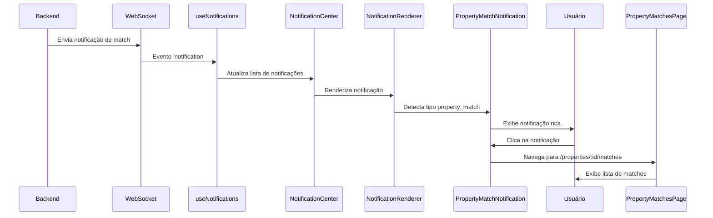

# 🎯 Sistema de Notificações de Matches de Propriedades - Frontend

## 📋 Resumo

Implementação frontend completa para o sistema de notificações automáticas de matches de propriedades. Quando o backend detecta clientes compatíveis com uma nova propriedade, o frontend exibe notificações ricas e permite navegação direta para visualizar os matches.

## ✨ Funcionalidades Implementadas

### 1. **Novos Tipos de Notificação**

Adicionados dois novos tipos de notificação no sistema:

- `property_match_found` - Match normal (score 60-79%)
- `property_match_high_score` - Match com alta compatibilidade (score ≥ 80%)

**Arquivo:** `src/utils/notificationNavigation.ts`

```typescript
export const NOTIFICATION_TYPE_LABELS: Record<string, string> = {
  // ... outros tipos
  PROPERTY_MATCH_FOUND: 'Match de Propriedade Encontrado',
  PROPERTY_MATCH_HIGH_SCORE: 'Match de Propriedade com Alta Compatibilidade',
  property_match_found: 'Match de Propriedade Encontrado',
  property_match_high_score: 'Match de Propriedade com Alta Compatibilidade',
};
```

### 2. **Navegação Inteligente**

O sistema de navegação foi atualizado para redirecionar usuários para a página correta ao clicar em notificações de match.

**Regras de Navegação:**
- Se `metadata.propertyId` existe → Redireciona para `/properties/:propertyId/matches`
- Caso contrário → Redireciona para `/matches`

**Arquivo:** `src/utils/notificationNavigation.ts`

```typescript
case 'property_match':
  if (notification.metadata?.propertyId) {
    return `/properties/${notification.metadata.propertyId}/matches`;
  }
  return `/matches`;
```

### 3. **Interface de Metadata**

Criada interface TypeScript para metadata de notificações de match com tipagem completa:

**Arquivo:** `src/utils/notificationNavigation.ts`

```typescript
export interface PropertyMatchNotificationMetadata {
  propertyId: string;
  propertyTitle: string;
  propertyCode?: string;
  totalMatches: number;
  highScoreMatches: number;
  propertyType?: string;
  propertyCity?: string;
  propertyState?: string;
  propertyPrice?: number;
  matchScores?: Array<{
    clientId: string;
    score: number;
  }>;
}
```

### 4. **Página de Matches de Propriedade**

Nova página dedicada para visualizar clientes compatíveis com uma propriedade específica.

**Arquivo:** `src/pages/PropertyMatchesPage.tsx`

**Características:**
- ✅ Exibe informações da propriedade no topo
- ✅ Filtros por status (Pendentes, Aceitos, Ignorados)
- ✅ Grid responsivo de matches
- ✅ Integração com sistema de aceitar/ignorar matches
- ✅ Navegação de volta para detalhes da propriedade

**Rota:** `/properties/:propertyId/matches`

**Registro no App.tsx:**
```typescript
<Route
  path='/properties/:propertyId/matches'
  element={
    <ErrorBoundary>
      <ProtectedRouteWithPermissions>
        <ProtectedRoute>
          <ModuleRoute requiredModule="match_system">
            <PermissionRoute permission='property:view'>
              <PropertyMatchesPage />
            </PermissionRoute>
          </ModuleRoute>
        </ProtectedRoute>
      </ProtectedRouteWithPermissions>
    </ErrorBoundary>
  }
/>
```

### 5. **Componente de Notificação Rico**

Componente visual especializado para exibir notificações de match com informações detalhadas.

**Arquivo:** `src/components/notifications/PropertyMatchNotification.tsx`

**Características:**

#### Visual Diferenciado
- 🎯 **Match Normal**: Ícone 🏠, borda azul
- ⭐ **Match High Score**: Ícone 🎯, borda vermelha com gradiente, animação de pulso

#### Informações Exibidas
- Título e mensagem da notificação
- Localização da propriedade (cidade, estado)
- Preço formatado em R$
- Total de clientes compatíveis
- Destaque para matches com alta compatibilidade (80%+)

#### Interatividade
- Hover effect com animação
- Badge de não lida
- Botão "Ver Matches →"
- Click para navegar

**Exemplo de Uso:**
```typescript
<PropertyMatchNotification 
  notification={notification}
  onRead={() => markAsRead(notification.id)}
/>
```

### 6. **Renderizador de Notificações**

Componente wrapper que detecta automaticamente o tipo de notificação e renderiza o componente apropriado.

**Arquivo:** `src/components/notifications/NotificationRenderer.tsx`

**Uso:**
```typescript
<NotificationRenderer 
  notification={notification}
  onRead={() => handleRead(notification.id)}
  fallbackComponent={DefaultNotificationCard}
/>
```

**Hook Utilitário:**
```typescript
const isPropertyMatch = useIsPropertyMatchNotification(notification);
```

### 7. **Estilos Atualizados**

Novos styled components adicionados para suportar a página de matches de propriedade.

**Arquivo:** `src/styles/pages/MatchesPageStyles.ts`

**Componentes Adicionados:**
- `BackButton` - Botão de voltar estilizado
- `PropertyInfo` - Container de informações da propriedade
- `PropertyInfoCard` - Card com detalhes da propriedade
- `PropertyTitle` - Título estilizado da propriedade
- `PropertyDetails` - Grid de detalhes
- `PropertyDetail` - Item individual de detalhe

## 📦 Arquivos Criados/Modificados

### Novos Arquivos

1. **`src/pages/PropertyMatchesPage.tsx`**
   - Página dedicada para matches de uma propriedade

2. **`src/components/notifications/PropertyMatchNotification.tsx`**
   - Componente rico para notificações de match

3. **`src/components/notifications/NotificationRenderer.tsx`**
   - Wrapper inteligente para renderização de notificações

4. **`docs/PROPERTY_MATCH_NOTIFICATIONS_FRONTEND.md`**
   - Esta documentação

### Arquivos Modificados

1. **`src/utils/notificationNavigation.ts`**
   - ✅ Adicionados novos tipos de notificação
   - ✅ Adicionados labels para os tipos
   - ✅ Adicionada lógica de navegação para matches
   - ✅ Criada interface `PropertyMatchNotificationMetadata`

2. **`src/styles/pages/MatchesPageStyles.ts`**
   - ✅ Adicionados componentes de estilo para PropertyMatchesPage

3. **`src/App.tsx`**
   - ✅ Importado `PropertyMatchesPage`
   - ✅ Registrada rota `/properties/:propertyId/matches`

## 🎨 Fluxo de Usuário



## 🚀 Como Usar

### 1. Integrar no NotificationCenter

```typescript
import { NotificationRenderer } from '../notifications/NotificationRenderer';

// No componente NotificationCenter
notifications.map(notification => (
  <NotificationRenderer
    key={notification.id}
    notification={notification}
    onRead={() => markAsRead(notification.id)}
  />
))
```

### 2. Exibir Notificação Diretamente

```typescript
import { PropertyMatchNotification } from '../notifications/PropertyMatchNotification';

<PropertyMatchNotification 
  notification={notification}
  onRead={() => handleRead(notification.id)}
/>
```

### 3. Navegar Programaticamente

```typescript
import { getNotificationNavigationUrl } from '../utils/notificationNavigation';

const url = getNotificationNavigationUrl(notification);
if (url) {
  navigate(url);
}
```

### 4. Verificar Tipo de Notificação

```typescript
import { useIsPropertyMatchNotification } from '../notifications/NotificationRenderer';

const isMatch = useIsPropertyMatchNotification(notification);
```

## 📊 Estrutura de Dados

### Exemplo de Notificação de Match (Backend → Frontend)

```json
{
  "id": "notif-uuid",
  "type": "property_match_high_score",
  "priority": "high",
  "title": "🎯 3 Matches Excelentes - Casa 3 Quartos Zona Sul",
  "message": "A propriedade 'Casa 3 Quartos Zona Sul' tem 5 clientes compatíveis!\n\n📍 Localização: São Paulo, SP\n💰 Valor: R$ 450.000,00\n📏 Área: 120m²\n\n⭐ 3 matches com alta compatibilidade (80%+)\n\n🎯 Clique para ver os detalhes dos matches e entrar em contato com os clientes!",
  "read": false,
  "actionUrl": "/properties/abc123-xyz789/matches",
  "entityType": "property_match",
  "entityId": "abc123-xyz789",
  "metadata": {
    "propertyId": "abc123-xyz789",
    "propertyTitle": "Casa 3 Quartos Zona Sul",
    "propertyCode": "1234567",
    "totalMatches": 5,
    "highScoreMatches": 3,
    "propertyType": "house",
    "propertyCity": "São Paulo",
    "propertyState": "SP",
    "propertyPrice": 450000,
    "matchScores": [
      { "clientId": "uuid1", "score": 92 },
      { "clientId": "uuid2", "score": 85 },
      { "clientId": "uuid3", "score": 81 },
      { "clientId": "uuid4", "score": 75 },
      { "clientId": "uuid5", "score": 68 }
    ]
  },
  "userId": "user-uuid",
  "companyId": "company-uuid",
  "createdAt": "2025-11-07T10:30:00Z",
  "updatedAt": "2025-11-07T10:30:00Z"
}
```

## 🎯 Mapeamento de Tipos

| Tipo Backend | Tipo Frontend | Prioridade | Ícone | Cor |
|--------------|--------------|------------|-------|-----|
| `property_match_found` | `property_match_found` | medium | 🏠 | Azul |
| `property_match_high_score` | `property_match_high_score` | high | 🎯 | Vermelho |

## 🔧 Customização

### Alterar Threshold de High Score

```typescript
// Em PropertyMatchNotification.tsx
const isHighScore = notification.type === 'property_match_high_score' || 
                    notification.type === 'PROPERTY_MATCH_HIGH_SCORE';
```

### Adicionar Novos Estilos

```typescript
// Em PropertyMatchNotification.tsx
const NotificationCard = styled.div<{ $isRead: boolean; $isHighScore: boolean }>`
  // Seus estilos personalizados
`;
```

### Customizar Navegação

```typescript
// Em notificationNavigation.ts
case 'property_match':
  // Adicionar lógica customizada
  if (customCondition) {
    return `/custom-route`;
  }
  return `/properties/${notification.metadata.propertyId}/matches`;
```

## 🐛 Troubleshooting

### Notificação não aparece

1. ✅ Verificar se o WebSocket está conectado: `useNotifications().connected`
2. ✅ Verificar se o tipo está correto: `property_match_found` ou `property_match_high_score`
3. ✅ Verificar logs do console para erros

### Navegação não funciona

1. ✅ Verificar se `metadata.propertyId` está presente
2. ✅ Verificar se a rota está registrada no `App.tsx`
3. ✅ Verificar permissões do usuário

### Estilos não aplicados

1. ✅ Verificar se o tema está configurado corretamente
2. ✅ Verificar variáveis CSS no tema
3. ✅ Verificar se styled-components está funcionando

## 📱 Responsividade

Todos os componentes são totalmente responsivos:

- **Desktop**: Grid de 3 colunas
- **Tablet**: Grid de 2 colunas
- **Mobile**: Grid de 1 coluna

## ♿ Acessibilidade

- ✅ Componentes semânticos
- ✅ Cores com contraste adequado
- ✅ Hover states claramente visíveis
- ✅ Mensagens descritivas

## 🎉 Recursos Futuros

- [ ] Notificações push do navegador
- [ ] Sons customizados para matches high score
- [ ] Filtros avançados na página de matches
- [ ] Exportação de lista de matches
- [ ] Integração com WhatsApp para contato direto

## 📚 Referências

- **Documentação Backend**: Ver arquivo raiz da documentação fornecida
- **Sistema de Notificações**: `docs/NOTIFICATION_API_MIGRATION.md`
- **Sistema de Matches**: `src/hooks/useMatches.ts`
- **API de Matches**: `src/services/matchApi.ts`

## 🏆 Conclusão

O sistema de notificações de matches está completamente integrado e pronto para uso. Quando o backend detecta clientes compatíveis com uma nova propriedade, o frontend:

1. ✅ Recebe notificação em tempo real via WebSocket
2. ✅ Exibe notificação rica com informações detalhadas
3. ✅ Permite navegação direta para página de matches
4. ✅ Diferencia visualmente matches normais de high score
5. ✅ Mantém estado de lido/não lido sincronizado

---

**Implementado em:** 07/11/2025  
**Versão Frontend:** 1.0.0  
**Compatível com Backend:** 1.0.0  
**Status:** ✅ Completo e Funcional

